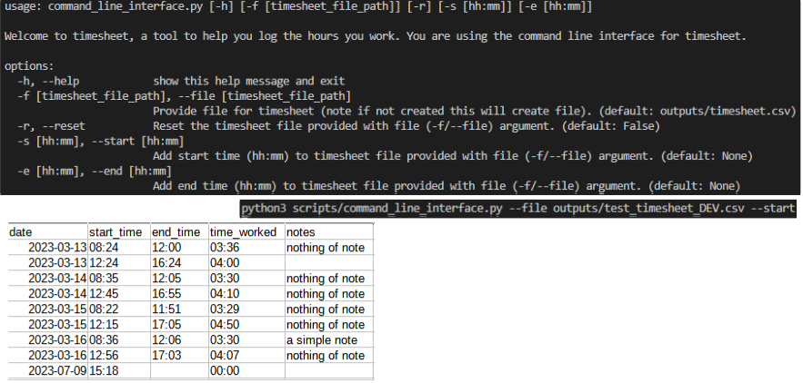
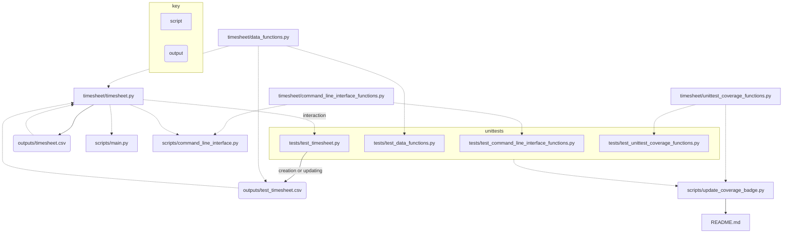

 [](https://github.com/psf/black)
 


# timesheet
Timesheet is a simple python package that enables you to track the hours you work via the command line. Information for the hours you work are stored in a simple CSV structure. See the screen grabs below to give you and idea of how it works.



# Plans for further development
- TODO calculate hours per day [#5](https://github.com/JosephCrispell/timesheet/issues/5)

## Running in the command line

### Install `timesheet`
Clone the repository with (note this is for https based link, change to suit your setup):
```bash
git clone https://github.com/JosephCrispell/timesheet.git
```
And install by navigating to repository and running:

```bash
pip install .
```

### Interact with command line interface
Run `scripts/command_line_interface.py` with:
```bash
python scripts/command_line_interface.py --help
```
```
usage: command_line_interface.py [-h] [-f [timesheet_file_path]] [-r] [-s [hh:mm]] [-e [hh:mm]]

Welcome to timesheet, a tool to help you log the hours you work. You are using the command line interface for timesheet.

options:
  -h, --help    show this help message and exit
  -f [timesheet_file_path], --file [timesheet_file_path]
                Provide file for timesheet (note if not created this will create file). (default: outputs/timesheet.csv)
  -r, --reset   Reset the timesheet file provided with file (-f/--file) argument. (default: False)
  -s [hh:mm], --start [hh:mm]
                Add start time (hh:mm) to timesheet file provided with file (-f/--file) argument. (default: None)
  -e [hh:mm], --end [hh:mm]
                Add end time (hh:mm) to timesheet file provided with file (-f/--file) argument. (default: None)
```

## Working with `timesheet` package directly
Here's some example code to get you started working with the `timesheet` package:
```python
# Package imports
from timesheet import timesheet  # import timesheet class

# Define main
def main():

    # Get timesheet
    my_timesheet = timesheet.Timesheet() # defaults to outputs/timesheet.csv

    # Add start time
    my_timesheet.add_start_time()

    # Add end time
    my_timesheet.add_end_time()

# Run on source
if __name__ == "__main__":
    main()
```

## Package structure
Directory tree generated using [file-tree-generator](https://marketplace.visualstudio.com/items?itemName=Shinotatwu-DS.file-tree-generator) Visual Studio Code extension:
```
📦timesheet
 ┣ 📂images
 ┃ ┣ 📜timesheet_demo.svg
 ┃ ┗ 📜timesheet_logo.svg
 ┣ 📂outputs
 ┃ ┣ 📜test_timesheet_DEV.csv
 ┃ ┗ 📜timesheet.csv
 ┣ 📂scripts
 ┃ ┣ 📜command_line_interface.py
 ┃ ┣ 📜main.py
 ┃ ┗ 📜update_test_coverage_badge.py
 ┣ 📂tests
 ┃ ┣ 📜__init__.py
 ┃ ┣ 📜test_command_line_interface_functions.py
 ┃ ┣ 📜test_data_functions.py
 ┃ ┣ 📜test_timesheet.py
 ┃ ┗ 📜test_unittest_coverage_functions.py
 ┣ 📂timesheet
 ┃ ┣ 📜__init__.py
 ┃ ┣ 📜command_line_interface_functions.py
 ┃ ┣ 📜data_functions.py
 ┃ ┣ 📜timesheet.py
 ┃ ┗ 📜unittest_coverage_functions.py
 ┣ 📜.coverage
 ┣ 📜.gitignore
 ┣ 📜.pre-commit-config.yaml
 ┣ 📜LICENSE
 ┣ 📜README.md
 ┣ 📜requirements.txt
 ┗ 📜setup.py
```

## Workflow
I created the following simple diagram using [mermaid](https://mermaid.js.org/) to show how the code and outputs link together.




## For development

### Install `timesheet` ⏰
Clone the repository with (onote this is for https based link, change to suit your setup):
```bash
git clone https://github.com/JosephCrispell/timesheet.git
```

And install by navigating to repository and running:
```bash
pip install -e .
```
Note the `-e` in above means the package will automatically update as you change the codebase.

### `precommit` installation ✔

Install python `pre-commit` with:
```bash
pip install pre-commit
```

Within repository folder run:
```bash
pre-commit install
```

The hooks within `.pre-commit-config.yaml` will now be triggered every time you use the `git commit` command. For more information see [pre-commit.com/](https://pre-commit.com/).

### Running tests 🧪
Unit tests for package are in `tests/` can be ran all together or individually, after running:
```bash
pip install -e .
```

To run all tests together:
```bash
python -m unittest
```

To run specific tests on `timesheet.py`:
```bash
python tests/test_timesheet.py
```

For more information see:
- [`unittest`](https://docs.python.org/3/library/unittest.html) package
- [Tutorial I found helpful](https://realpython.com/python-testing/)

### Updating coverage badge 🦡
To update the coverage badger of this README run:
```python
python scripts/update_test_coverage_badge.py
```
This script uses the [`coverage`](https://coverage.readthedocs.io/) python package to generate a coverage report and then feeds overall test coverage value into badge for this README.
> Note must be ran from repository root as shown in above codeblock

### Building the docs 🔨📚
The documentation for the `timesheet` package is built using [Sphinx](https://pypi.org/project/Sphinx/). To build and view the documentation (note still in a crude state) follow these steps:
1. Install sphinx: `pip install Sphinx`
2. Navigate to `docs/` and run `make html`
3. Open a file browser and navigate to and double click on `docs/build/html/index.html`

For more information see:
- [Sphinx documentation](https://www.sphinx-doc.org/en/master/)
- [Intro to sphinx documentation](https://docs.readthedocs.io/en/stable/intro/getting-started-with-sphinx.html)
- [this great blog](https://samnicholls.net/2016/06/15/how-to-sphinx-readthedocs/)
