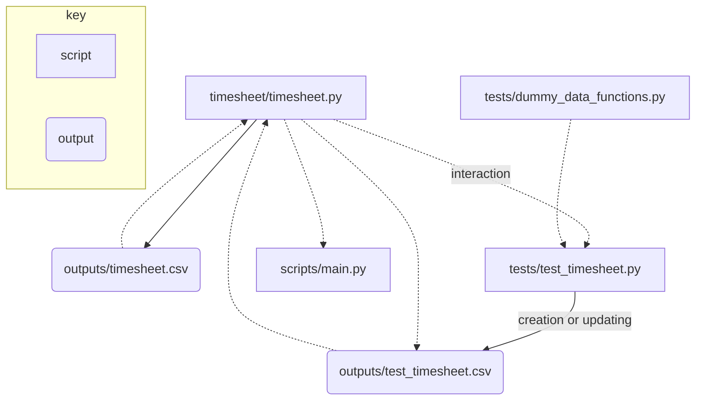

 [](https://github.com/psf/black)

# timesheet
[IN DEVELOPMENT] a tool for tracking the hours you work

## Running in the command line
After running:
```bash
pip3 install -e .
```

Run `scripts/main.py` with:
```bash
python3 scripts/main.py
```

## Package structure
Directory tree generated using [file-tree-generator](https://marketplace.visualstudio.com/items?itemName=Shinotatwu-DS.file-tree-generator) Visual Studio Code extension:
```
📦timesheet
 ┣ 📂outputs
 ┃ ┣ 📜.gitkeep
 ┣ 📂scripts
 ┃ ┗ 📜main.py
 ┣ 📂tests
 ┃ ┗ 📜test_timesheet.py
 ┣ 📂timesheet
 ┃ ┣ 📜timesheet.py
 ┃ ┗ 📜__init__.py
 ┣ 📜.gitignore
 ┣ 📜.pre-commit-config.yaml
 ┣ 📜LICENSE
 ┣ 📜README.md
 ┣ 📜requirements.txt
 ┗ 📜setup.py
```

## Workflow
I created the following simple diagram using [mermaid]() to show how the code and outputs link together.




## For development

### `precommit` installation

Install python `pre-commit` with:
```bash
pip install pre-commit
```

Within repository folder run:
```bash
pre-commit install
```

The hooks within `.pre-commit-config.yaml` will now be triggered every time you use the `git commit` command. For more information see [pre-commit.com/](https://pre-commit.com/).

### Running tests
Unit tests for package are in `tests/` and can be called directly, after running:
```bash
pip3 install -e .
```

For example to run tests on `timesheet.py`:
```bash
python3 -m unittest
```

For more information see:
- [`unittest`](https://docs.python.org/3/library/unittest.html) package
- [Tutorial I found helpful](https://realpython.com/python-testing/)
