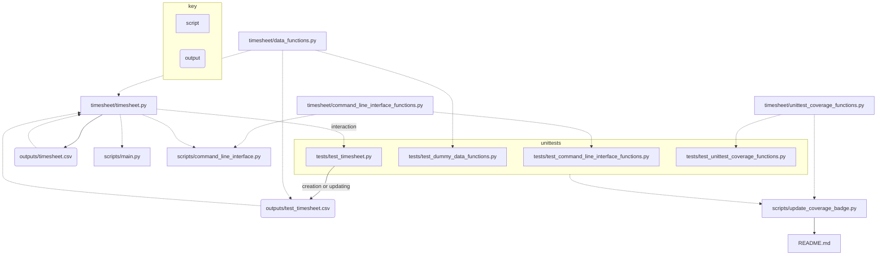

 [](https://github.com/psf/black)
 

# timesheet
[IN DEVELOPMENT] a tool for tracking the hours you work

## Running in the command line
After running:
```bash
pip3 install -e .
```

Run `scripts/command_line_interface.py` with:
```bash
python3 scripts/command_line_interface.py --help
```
```
usage: command_line_interface.py [-h] [-f [timesheet_file_path]] [-r] [-s [hh:mm]] [-e [hh:mm]]

Welcome to timesheet, a tool to help you log the hours you work. You are using the command line interface for timesheet.

options:
  -h, --help    show this help message and exit
  -f [timesheet_file_path], --file [timesheet_file_path]
                Provide file for timesheet (note if not created this will create file). (default: outputs/timesheet.csv)
  -r, --reset   Reset the timesheet file provided with file (-f/--file) argument. (default: False)
  -s [hh:mm], --start [hh:mm]
                Add start time (hh:mm) to timesheet file provided with file (-f/--file) argument. (default: None)
  -e [hh:mm], --end [hh:mm]
                Add end time (hh:mm) to timesheet file provided with file (-f/--file) argument. (default: None)
```

## Package structure
Directory tree generated using [file-tree-generator](https://marketplace.visualstudio.com/items?itemName=Shinotatwu-DS.file-tree-generator) Visual Studio Code extension:
```
📦timesheet
 ┣ 📂outputs
 ┃ ┣ 📜.gitkeep
 ┃ ┣ 📜test_timesheet_DEV.csv
 ┃ ┗ 📜timesheet.csv
 ┣ 📂scripts
 ┃ ┣ 📜main.py
 ┃ ┗ 📜update_test_coverage_badge.py
 ┣ 📂tests
 ┃ ┣ 📜__init__.py
 ┃ ┣ 📜test_data_functions.py
 ┃ ┣ 📜test_timesheet.py
 ┃ ┗ 📜test_unittest_coverage_functions.py
 ┣ 📂timesheet
 ┃ ┣ 📜__init__.py
 ┃ ┣ 📜data_functions.py
 ┃ ┣ 📜timesheet.py
 ┃ ┗ 📜unittest_coverage_functions.py
 ┣ 📜.coverage
 ┣ 📜.gitignore
 ┣ 📜.pre-commit-config.yaml
 ┣ 📜LICENSE
 ┣ 📜README.md
 ┣ 📜requirements.txt
 ┗ 📜setup.py
```

## Workflow
I created the following simple diagram using [mermaid](https://mermaid.js.org/) to show how the code and outputs link together.




## For development

### `precommit` installation

Install python `pre-commit` with:
```bash
pip install pre-commit
```

Within repository folder run:
```bash
pre-commit install
```

The hooks within `.pre-commit-config.yaml` will now be triggered every time you use the `git commit` command. For more information see [pre-commit.com/](https://pre-commit.com/).

### Running tests
Unit tests for package are in `tests/` can be ran all together or individually, after running:
```bash
pip3 install -e .
```

To run all tests together:
```bash
python3 -m unittest
```

To run specific tests on `timesheet.py`:
```bash
python3 tests/test_timesheet.py
```

For more information see:
- [`unittest`](https://docs.python.org/3/library/unittest.html) package
- [Tutorial I found helpful](https://realpython.com/python-testing/)

### Updating coverage badge
To update the coverage badger of this README run:
```python
python scripts/update_test_coverage_badge.py
```
This script uses the [`coverage`](https://coverage.readthedocs.io/) python package to generate a coverage report and then feeds overall test coverage value into badge for this README.
> Note must be ran from repository root as shown in above codeblock
