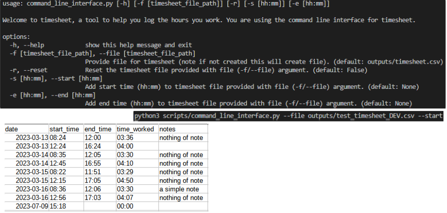

.. timesheet documentation master file, created by
   sphinx-quickstart on Wed Jun  7 19:52:42 2023.
   You can adapt this file completely to your liking, but it should at least
   contain the root `toctree` directive.

Welcome to timesheet's documentation!
=====================================

`timesheet`` is a simple python package that enables you to track the hours you work via the command line. Information for the hours you work are stored in a simple CSV structure. See the screen grabs below to give you and idea of how it works.

.. note::

   This project is under development.

.. toctree::
   :maxdepth: 2

   modules

Indices and tables
==================

* :ref:`genindex`
* :ref:`modindex`
* :ref:`search`
